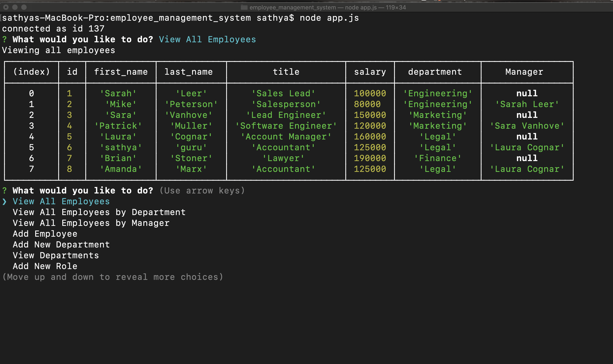
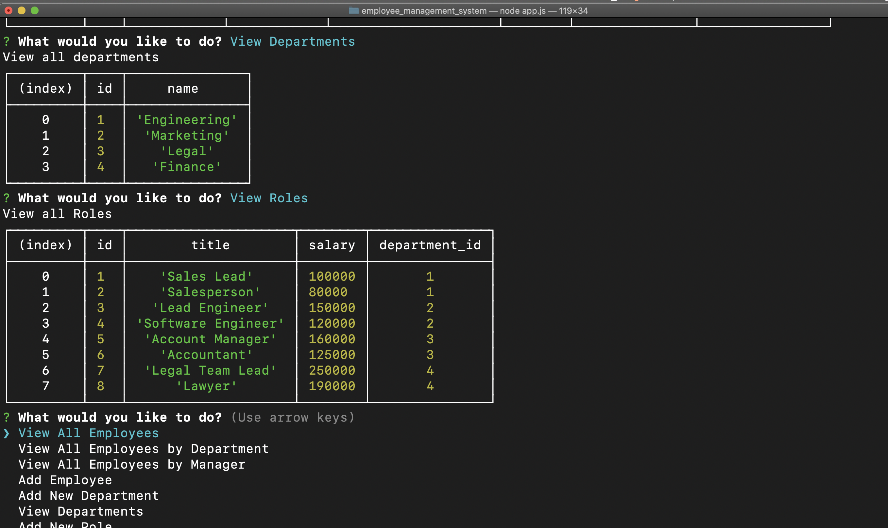

# Employee Management System


## Description

This Application is a command-line interface (CLI) that allows a user to keep track of employees through a company's database. The application uses MySQL to store, create and delete all employee information.
This application manages a company's employees using node, inquirer, and MySQL. An employer will be able to add departments, employees, and roles with their corresponding information using prompts. You can view the Application demo [here](https://drive.google.com/file/d/1PeFjvZ3ODH6b3LBD6Hv4lcoUTpfUsa_c/view?usp=sharing).


## Table of Contents

1. [Installation](#Installation)
2. [Usage](#Usage)
3. [Contributing](#Contributing)
4. [License](#licence) 

## Installation
* Clone the repository to your local device.
* Install the required packages via 
```
npm install
```

 Here we need some dependencies like,

* **inquirer** - For the CLI user interface. This will prompt user within the CLI for employee information.
* **console.table** - Used to print MySQL into tables to the console.
* **mysql** - Used to connect to the MySQL database and perform queries.

## Usage
* This application is run by executing,
```
node app.js
```
* The user is brought to a main menu with a list of commands that can be execute. Some options have further choices and prompts to interact with the system.
* You need to set up your MySQL database before you run the code.
* This Node application is for a business owner to be able to view and manage departments, roles, and employees in their company in order to organize and plan their business.


## Contributing

Contributions are welcome. You can create an issue or submit a pull request.

## License

MIT license

## Screenshots





